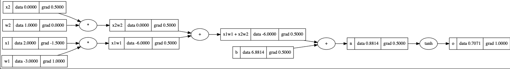

# gradRev: Understanding Backpropagation in PyTorch with Autograd

**gradrev** is a Python library that provides a simplified implementation of autograd to help understand the mechanics of backpropagation in PyTorch and demystify the inner workings of PyTorch's autograd.

## Introduction

Deep learning and neural networks have become essential tools in various fields, from computer vision to natural language processing. PyTorch is a popular deep learning framework that employs automatic differentiation, also known as autograd, to calculate gradients for backpropagation.

Understanding how autograd works is fundamental to grasp the training process of neural networks. **gradrev** simplifies this complex concept, allowing you to explore the core principles of backpropagation without the need for a deep dive into PyTorch's source code.

```python
# o = tan(x1w1 + x2w2 + b)
rom gradrev import engine
from gradrev import nn

draw_dot = nn.draw_dot
Value = engine.Value

# Implementation of backprop on neuron 

# inputs 
x1 = Value(2.0)
x2 = Value(0.0)

# weights 
w1 = Value(-3.0)
w2 = Value(1.0)

# bias of neuron
b = Value(6.8813735870195432)

# x1w1 + x2w2 + b
x1w1 = x1*w1 
x2w2 = x2*w2 
x1w1x2w2 = x1w1 + x2w2 
n = x1w1x2w2 + b 
o = n


o.backward()
dot = draw_dot(o)
dot.render()
```


